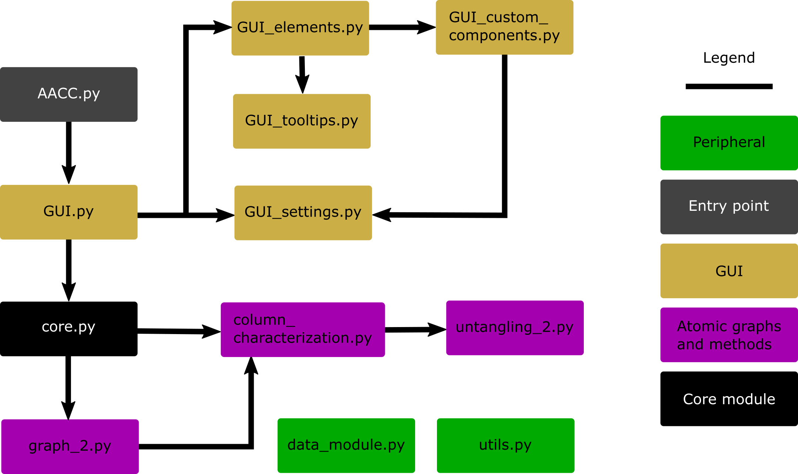

Documentation
---------------------------------------------

The modular structure of AutomAl 6000 is shown below. It has a **core** module that internally acts as an API
for the **GUI**. The **core** module is what controls the project data and workflow. Its main goal is to
translate information from a HAADF-STEM image into information in the form of digraph-like *atomic graphs*.
The graphs and related mathematics and data is contained in the **graph** module, which in turn uses
graph operations from the **column_characterization** module. The GUI is built to plug
into the **core** module, but the core module does not know about the GUI. In the image below, arrows
indicate plug-in direction, ie if module **A** points to module **B**, then **A** imports **B**, etc...

    Figure 5.1: Import graph for AutomAl 6000

.. toctree::
    :caption: Modules

    AACC
    core
    column_detection
    graph_2
    column_characterization
    untangling_2
    data_module
    utils
    GUI
    GUI_elements
    GUI_custom_components

